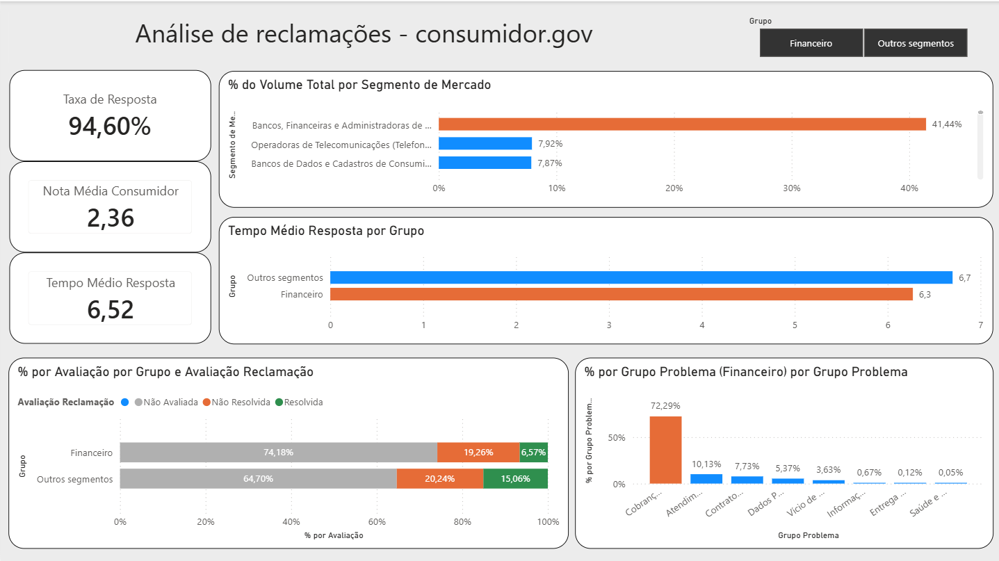

# 📊 Análise de Reclamações — Consumidor.gov


Análise exploratória de reclamações registradas no **Consumidor.gov.br**, com o objetivo de identificar padrões de volume, resposta, resolução e percepção dos consumidores entre diferentes segmentos de empresas.

O projeto utiliza **Python (Pandas)** para preparação dos dados e **PostgreSQL + SQL** para armazenamento e análise.

> 📌 **Status:** análise em SQL concluída | Dashboard em Power BI concluído

---

## 📊 Dashboard



O dashboard interativo foi construído no Power BI, permitindo comparar o segmento financeiro com demais segmentos em volume, tempo de resposta, taxa de resolução e categoria de problema.

- **Nota:** Optei por não usar o campo nome fantasia para comparação entre empresa, pois trata-se de um nome comercial informal, o que o torna menos confiável como identificador para esta análise. A comparação foi conduzida no nível de Segmento de Mercado.

---

## 🎯 Objetivo

Transformar os dados de reclamações em indicadores que permitam comparar o desempenho dos diferentes segmentos, respondendo perguntas como:

1. Quais segmentos possuem maior participação no volume total de reclamações?
2. O segmento com maior volume também apresenta um bom índice de resolução?
3. Existe diferença entre taxa/tempo de resposta e efetividade da resolução?
4. Quais segmentos apresentam maior tempo médio de resposta?
5. Como a percepção dos consumidores varia entre os segmentos?

Essas perguntas orientaram as consultas SQL, evitando uma análise baseada apenas em estatísticas descritivas.

---

## 📅 Dados analisados

* **Fonte:** [Consumidor.gov.br — Dados Abertos](https://www.consumidor.gov.br)
* **Período:** janeiro a junho de 2026
* **Volume:** ~2,01 milhões de reclamações (2.014.153 registros tratados)

---

## 🛠️ Tecnologias utilizadas

| Tecnologia          | Utilização                                                    |
| ------------------- | ------------------------------------------------------------- |
| **Python (Pandas)** | Tratamento e preparação dos dados                             |
| **PostgreSQL**      | Armazenamento dos dados                                       |
| **SQL**             | Exploração, agregação e análise dos dados                     |
| **Power BI**        | Visualização e dashboard                                      |

---

## 🔄 Metodologia

1. **Coleta:** dados obtidos da base pública do Consumidor.gov.br.
2. **Preparação:** tratamento com Pandas — leitura, checagem de tipos, tratamento de nulos e padronização das colunas ([`notebooks/preparacao_dados.ipynb`](notebooks/preparacao_dados.ipynb)).
3. **Armazenamento:** carga no PostgreSQL via `\copy` ([`sql/criacao_tabela.sql`](sql/criacao_tabela.sql)).
4. **Análise exploratória:** consultas SQL para investigar volume, participação por segmento, taxa de resposta, índice de resolução, tempo médio de resposta e avaliação dos consumidores ([`sql/analise_consumidor_gov.sql`](sql/analise_consumidor_gov.sql)).

---

## ▶️ Como reproduzir

```bash

# 1. Clone o repositório
git clone https://github.com/JaqueSoaresCruz/consumidor-gov-analise.git
cd consumidor-gov-analise

# 2. Crie um ambiente virtual e instale as dependências
python -m venv venv
source venv/bin/activate  # Windows: venv\Scripts\activate
pip install -r requirements.txt

# 3. Crie um banco PostgreSQL e configure a conexão
# (edite as credenciais no notebook ou em um arquivo .env)

# 4. Rode o notebook de preparação dos dados
jupyter notebook notebooks/preparacao_dados.ipynb

# 5. Crie a tabela e importe os dados (o \copy exige o cliente psql)
psql -U seu_usuario -d seu_banco -f sql/criacao_tabela.sql

# 6. Rode as análises
psql -U seu_usuario -d seu_banco -f sql/analise_consumidor_gov.sql

```

> ⚠️ O arquivo `data/dados_consumidor.gov.csv` não está incluso no repositório por tamanho. Baixe a base diretamente em [dados.gov.br](https://dados.gov.br) e coloque na pasta `data/`.

---

## 🔎 Principais resultados

## 1. Volume de reclamações

O segmento de **Instituições Financeiras — Bancos, Financeiras e Administradoras de Cartão** concentra aproximadamente **41,44% de todas as reclamações da base**, tornando-se o principal foco da análise comparativa.

## 2. Tempo médio de resposta

| Grupo          | Tempo médio de resposta |
| -------------- | -----------------------: |
| **Geral**      |                6,52 dias |
| **Financeiro** |                6,27 dias |

> Tempo médio de resposta = média dos valores da coluna `Tempo Resposta`, disponibilizada na base original do Consumidor.gov.br, considerando apenas reclamações respondidas (a base não traz uma data de abertura para cálculo manual do intervalo).

O financeiro responde, em média, 0,25 dia mais rápido que a base geral — uma diferença pequena, mas na direção contrária ao que a percepção pública costuma sugerir sobre o setor. Alguns segmentos chegam a 8–9 dias de tempo médio.

## 3. Taxa de resposta

| Grupo          | Taxa de resposta |
| -------------- | ----------------: |
| **Geral**      |              94,5% |
| **Financeiro** |              94,6% |

> Taxa de resposta = percentual de reclamações que receberam resposta da empresa (campo `Respondida = S`) sobre o total de reclamações do grupo.

As taxas são praticamente equivalentes — a diferença de 0,1 ponto percentual não é relevante na prática.

## 4. Índice de resolução

| Avaliação                          |      Geral | Financeiro |
| ----------------------------------- | ---------: | ---------: |
| Não avaliada                        |     68,63% |     74,18% |
| Não resolvida                       |     19,83% |     19,26% |
| Resolvida                           |     11,54% |      5,57% |
| **% resolvida entre as avaliadas**  | **36,79%** | **25,44%** |

> Índice de resolução = percentual de reclamações marcadas como "Resolvida" (campo `Avaliação Reclamação`), calculado sobre o total de reclamações e, na última linha, apenas sobre as que foram efetivamente avaliadas pelo consumidor (excluindo "Não avaliada").

O financeiro tem menos reclamações avaliadas e, entre as avaliadas, resolve proporcionalmente menos — uma diferença de ~11 pontos percentuais.

## 5. Avaliação dos consumidores

| Grupo          | Nota média |
| -------------- | ---------: |
| **Geral**      |       2,36 |
| **Financeiro** |       2,04 |

> Nota média = média das notas atribuídas pelo consumidor (campo `Nota do Consumidor`), considerando apenas reclamações avaliadas.

## 6. Principais categorias de problema — Financeiro

**"Cobrança / Contestação"** concentra ~603.333 reclamações — cerca de **72% do total do segmento**.

---

## 🧠 Interpretação

O segmento financeiro concentra **41,44% do volume total**, mas seu **tempo e taxa de resposta são semelhantes — ou até levemente melhores — que a média geral**. A diferença aparece depois da resposta: menor efetividade na resolução (25,44% vs. 36,79%) e pior percepção do consumidor (nota 2,04 vs. 2,36).

> **Principal insight:** o segmento financeiro responde em ritmo e proporção semelhantes à média geral (e até um pouco mais rápido), mas apresenta menor efetividade na resolução e pior percepção dos consumidores — o problema não está na velocidade de resposta, mas na qualidade da solução oferecida.

A concentração de ~72% das reclamações do segmento em "Cobrança / Contestação" é um ponto sensível, mas não é possível aprofundar as causas com base apenas nos dados públicos disponíveis.

---

## 📂 Estrutura do projeto

```text
consumidor-gov-analise/  
├── data/
│   └── dados_consumidor.gov.csv
│
├── images/
│   └── dashboard_consumidor_gov.png
│
├── notebooks/
│   └── preparacao_dados.ipynb
│
├── sql/
│   ├── criacao_tabela.sql
│   └── analise_consumidor_gov.sql
│
├── README.md
└── requirements.txt
```

---

## 🚀 Próximos passos

* [  ] Automatizar coleta
* [  ] Conectar VS Code ao PostgreSQL
* [  ] Criar funções/views no Postgresql
* [  ] Conectar PowerBI ao Postgresql


---

## 📌 Conclusão

O projeto percorre um fluxo completo de análise de dados — preparação, armazenamento em PostgreSQL e exploração via SQL — sobre uma base pública de grande volume. Mais do que estatísticas descritivas, buscou responder perguntas de negócio e identificar diferenças reais de desempenho entre segmentos.

O principal achado foi o contraste entre volume, resposta e efetividade da resolução no segmento financeiro. O projeto conta com dashboard interativo em Power BI, disponivel na seção acima.

---

## 📚 Fonte dos dados

[Consumidor.gov.br — Dados Abertos](https://www.consumidor.gov.br)

## 👤 Autor

[](https://www.linkedin.com/in/jaqueline-soares-da-cruz) · [](mailto:jaqueline.dacruz6789@gmail.com)